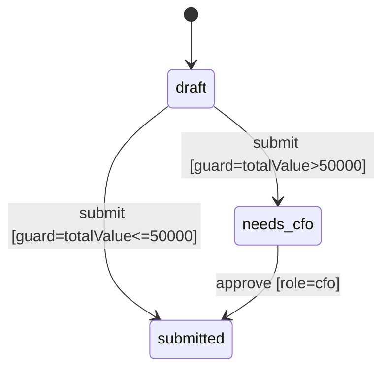

# Verdict Round 5: Intent-Pack Spec + Generic Kernel

**Date**: 2025-01-12  
**Status**: Updated verdict with formal change-pack spec and examples  
**Purpose**: Align architecture with an AI-friendly, ecosystem-ready authoring format

---

## Executive Summary

**Updated Feasibility: 74%**

The formal change-pack spec strengthens the approach by making AI changes
structured, reviewable, and testable without compromising runtime determinism.

**Verdict**: Proceed with the constrained kernel + advisory AI, backed by
change packs as the external change protocol.

---

## What Changed Since Round 4

- Change packs are now a formal external spec (manifest + intent + patch + tests)
- `userStory` and `acceptanceCriteria` are mandatory, reducing AI drift
- Diagrams are required for workflow changes, enabling visual validation

---

## Updated Risk Assessment

### Reduced Risk
- **AI alignment drift** (mitigated by mandatory user story + acceptance criteria)
- **Reviewability** (diff + tests + diagram in every pack)

### Remaining Risks
- **Authoring UX**: still the main adoption bottleneck
- **Extension determinism**: plugin/function safety must be explicit
- **Data sparsity for AI**: early tenants may lack signal for suggestions

---

## Examples (Change Pack Artifacts)

### Example Pack Layout

```
change-packs/
  change-2025-01-12-001/
    manifest.json
    intent.md
    changes.json
    tests.yaml
    diagram.mmd
```

### Example intent.md (Front Matter + Required Section)

```markdown
---
specVersion: "1.0"
id: change-2025-01-12-001
title: Require approval for high-value submissions
summary: Add guarded transition for high-value submit events.
author: ai
status: draft
createdAt: "2025-01-12T10:00:00Z"
userStory: >
  As a finance approver, I want submissions over 50k to require CFO approval
  so I can reduce high-risk errors.
acceptanceCriteria:
  - Submit fails unless CFO approves when totalValue > 50000
  - Standard submissions remain unchanged
  - Audit log records the block reason
targets:
  - configType: workflow
    configId: order
---

## User Intent (Confirmation)
- What they want: Block high-value submits unless CFO approves.
- What they do not want: Any schema changes or new fields.
- Acceptance criteria: See front matter.
```

### Example changes.json (JSON Patch)

```json
[
  {
    "op": "add",
    "path": "/transitions/0/guards/-",
    "value": {
      "type": "field",
      "field": "computed.totalValue",
      "operator": "gt",
      "value": 50000
    }
  }
]
```

### Example tests.yaml

```yaml
specVersion: "1.0"
cases:
  - name: "blocks high value submit"
    entity: { totalValue: 60000 }
    workflowState: "draft"
    action: { type: "transition", payload: { event: "submit" } }
    expected:
      success: false
      errorsContain: ["requires approval"]
```

### Example diagram.mmd (Mermaid)



---

## Final Verdict

The design is now coherent, extensible, and AI-friendly without sacrificing
determinism. The change-pack spec makes external ecosystem integration viable
and enables tooling (validators, diagram generators, PR-style reviews).

**Proceed with Round 4 architecture + Round 5 change-pack spec.**

